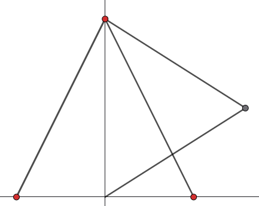

## Firmware for FEMTO-Euclid 3D printer

Based on Marlin, ESP3DLib and ESP3D-WEBUI
https://github.com/luc-github/Marlin/tree/ESP3D-V3-2.1.x
https://github.com/luc-github/ESP3DLib/tree/3.0
Please note that ESP3DLib was still in alpha at the moment

## Flashing to ESP32 (Firmware + ESP3D-WEBUI)

### 1) Flash the firmware from this repo

1. Connect your ESP32 board by USB.
2. Select the correct PlatformIO environment
	- `mks_tinybee`
	- note: `platformio.ini` default env may differ; use `-e mks_tinybee` for this board
3. Build and flash:

```bash
pio run -e mks_tinybee -t upload
```

For AI agents (or any non-interactive shell), use the repository wrapper so the build doesn't depend on `pio` being on `PATH`:

```bash
# from /FEMTO3D/FemtoMarlin
./buildroot/bin/pio_build mks_tinybee

# from /FEMTO3D
./FemtoMarlin/buildroot/bin/pio_build mks_tinybee

# make target
make build BUILD_ENV=mks_tinybee
```

If auto-detection fails, set your serial port in `ini/esp32.ini` (or pass `--upload-port <port>`).

If your build fails with a missing `Configuration_Secure.h`, create `Marlin/Configuration_Secure.h` with your WiFi credentials:

```cpp
#define WIFI_SSID "your-ssid"
#define WIFI_PWD  "your-password"
```

### 2) Install / update ESP3D-WEBUI on the ESP32

This repository does not bundle ESP3D-WEBUI files directly for filesystem upload, so use the official ESP3D-WEBUI release package:

1. Download the latest package from: https://github.com/luc-github/ESP3D-WEBUI/releases
2. Open the ESP3D web interface on your device (or use serial commands if you prefer).
3. Use the ESP3D update page to upload the WEBUI package to the ESP32 filesystem.
4. Reboot the board and refresh the browser.

### 3) Quick verify

- Serial monitor works at `115200` baud.
- ESP3D page loads from the board IP / hostname.
- Printer controls and status update in the WEBUI.

---

## FEMTO_BILAT Kinematics Configuration Guide

This firmware includes a custom kinematics mode for FEMTO-Euclid:

- 2D cable bilateration for XY (two cable lengths from anchors A/B)
- independent linear Z axis (lead screw)

The math model is:

- `r1 = sqrt((x - ax)^2 + (y - ay)^2)`
- `r2 = sqrt((x - bx)^2 + (y - by)^2)`

Where:

- `A = (ax, ay)` and `B = (bx, by)` are fixed anchor points
- `P = (x, y)` is toolhead position
- `r1`, `r2` are cable lengths to anchors A and B

### 1) Ensure FEMTO_BILAT is enabled in Configuration.h

In `Marlin/Configuration.h`:

1. Ensure `#define FEMTO_BILAT` is enabled
2. Set the FEMTO_BILAT parameters:

```cpp
#define FEMTO_BILAT
#if ENABLED(FEMTO_BILAT)
	#define FEMTO_BILAT_ANCHOR_A_X 0.0f
	#define FEMTO_BILAT_ANCHOR_A_Y 0.0f
	#define FEMTO_BILAT_ANCHOR_B_X 220.0f
	#define FEMTO_BILAT_ANCHOR_B_Y 0.0f
	#define FEMTO_BILAT_SOLUTION_HIGH true
	#define FEMTO_BILAT_SEGMENTS_PER_SECOND 5
#endif
```

### 2) Parameter meanings and how to determine them

#### `FEMTO_BILAT_ANCHOR_A_X`, `FEMTO_BILAT_ANCHOR_A_Y`

Anchor A position in machine coordinates (mm).

Recommended coordinate convention:

- origin at lower-left of usable XY plane
- +X to the right
- +Y to the back (or whichever convention your machine uses consistently)

How to determine:

1. Choose your coordinate origin physically.
2. Measure anchor A center position relative to origin.
3. Use mm values in firmware.

#### `FEMTO_BILAT_ANCHOR_B_X`, `FEMTO_BILAT_ANCHOR_B_Y`

Anchor B position in machine coordinates (mm).

How to determine:

1. Measure anchor B center relative to the same origin.
2. Ensure A and B are not identical points.
3. Prefer accurate center-to-center measurement (caliper/jig if possible).

#### `FEMTO_BILAT_SOLUTION_HIGH`

Bilateral circle intersection has two geometric solutions. This flag selects which one to use.

- `true`: one side of line AB
- `false`: opposite side

How to determine:

1. Keep anchors fixed.
2. Move to a known XY point near center of workspace.
3. If reported/actual location is mirrored across AB, flip this flag.

#### `FEMTO_BILAT_SEGMENTS_PER_SECOND`

Interpolation density for kinematic motion planning.

- Lower values: less CPU load, rougher path approximation
- Higher values: smoother path, higher CPU usage

Starting point:

- 5 (default) for first bring-up
- increase gradually (e.g., 8, 10, 12) if motion quality requires it

### 3) Set motor steps per mm for cable axes

Cable length is represented as axis movement, so cable spool calibration is critical.

In `DEFAULT_AXIS_STEPS_PER_UNIT` (or with `M92`), X and Y should represent cable-length mm for motor 1 and motor 2.

Use:

- `steps_per_mm = (motor_steps_per_rev * microsteps * gear_ratio) / (2 * pi * R_eff)`

Where:

- `R_eff` is effective spool radius in mm
- `gear_ratio` = output_rev / motor_rev (use 1.0 if direct)

Practical advice:

1. Start with geometric estimate from spool diameter.
2. Command a known cable-length change.
3. Measure actual cable movement and refine steps/mm.

If spool radius changes significantly with layering, expect scale drift across long moves and plan a compensation model later.

### 4) Runtime tuning with M665

FEMTO_BILAT supports runtime updates:

- `M665 S...` segments per second
- `M665 A... B...` anchor A `(x, y)`
- `M665 C... D...` anchor B `(x, y)`
- `M665 I0|I1` solution side

Examples:

```gcode
M665 A0.0 B0.0 C220.0 D0.0 I1 S5
M665
```

Persist to EEPROM:

```gcode
M500
```

Restore from EEPROM:

```gcode
M501
```

### 5) Bring-up and calibration workflow

Because this machine has no automatic XY homing, use a controlled startup sequence.

1. Mechanically place toolhead at a known reference point.
2. Set current coordinates (`G92 X... Y... Z...`) to match that known point.
3. Verify small XY jogs move in the expected physical direction.
4. Verify `M114` tracks position consistently.
5. Check several points across workspace and refine:
	 - anchor coordinates
	 - X/Y cable steps per mm
	 - solution side flag

Suggested first validation pattern:

- center → +X small move → back
- center → +Y small move → back
- small square path near center

### 6) Homing sequence for all axes

FEMTO_BILAT has no built-in XY homing routine, so home Z separately and set XY manually.

Recommended sequence on power-up:

1. Manually place the toolhead at a known XY reference point.
2. Set XY with `G92 X... Y...` to match that reference.
3. Home Z only: `G28 Z` (or `G28` if you have Z-only endstop/probe configured).

If you do have reliable X/Y endstops (or a custom XY homing method), then a full `G28` is fine.

### 7) Troubleshooting quick reference

- Mirrored XY behavior: toggle `FEMTO_BILAT_SOLUTION_HIGH` (or `M665 I0/I1`)
- Global scale error: adjust X/Y cable steps per mm
- Position error increases away from center: re-measure anchor coordinates
- Jagged curved motion: raise `FEMTO_BILAT_SEGMENTS_PER_SECOND` carefully

### 8) Recommended first-pass defaults

- conservative acceleration and feedrate during first bring-up
- low jerk / junction aggressiveness
- short moves only until geometry is confirmed

After geometry and scaling are stable, tune speed and acceleration upward.
